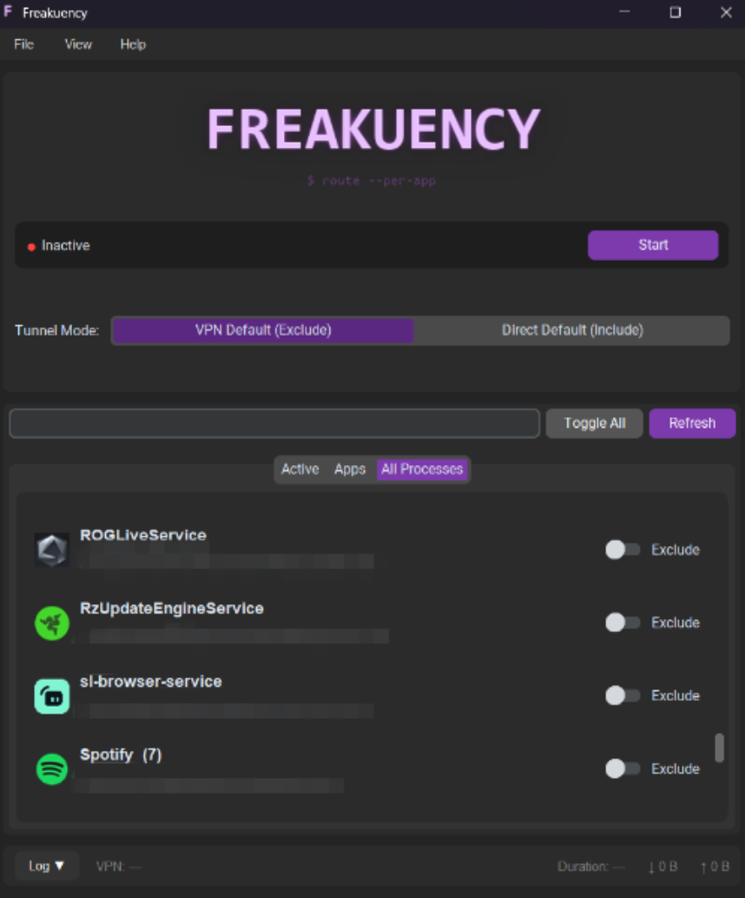

<p align="center">
  
</p>

<p align="center">
  <b>Per-application VPN split tunneling for Windows.</b><br/>
  Pick which apps use your VPN and which go direct — works with any VPN client.
</p>

<p align="center">
  
  
  
  
</p>

<p align="center">
  
</p>

---

Most VPN clients force **all** your traffic through the tunnel. Some have split tunneling built in — most don't, and the ones that do are limited. Freakuency sits between your apps and the network stack, intercepting packets at the kernel level and rerouting them per-application. It works alongside **any** VPN client — OpenVPN, WireGuard, NordVPN, Mullvad, ExpressVPN, whatever you use.

Connect your VPN first. Launch Freakuency. Toggle the apps you want to exclude (or include). Done.

## Why Freakuency?

Your VPN protects your traffic but routes everything through a server that might be thousands of miles away. That means:

- Your game goes from 30ms ping to 120ms
- Your work VPN prevents Spotify from working
- Your geo-unlocked streaming app conflicts with your banking site
- Downloads crawl because they're bouncing through a tunnel

Freakuency fixes this. Keep the protection where you want it, skip it where you don't.

## How it works

Freakuency uses [WinDivert](https://reqrypt.org/windivert.html) — a kernel-mode packet interception driver — to capture and rewrite network packets in real time. No proxies, no DNS hacks, no wrapper processes.

```
                         ┌──────────────┐
    Toggled apps ───────>│  Default NIC  │───> Direct Internet
                         └──────────────┘
    App sends packet
         │               ┌──────────────┐
         ├── All other ─>│   VPN NIC    │───> VPN Tunnel
         │   traffic     └──────────────┘
         │
    WinDivert captures
    outbound packet
         │
    ┌────▼──────┐
    │ Identify  │  Port → PID → exe path
    │ process   │  (tracker + synchronous Windows API fallback)
    └────┬──────┘
         │
    ┌────▼──────┐
    │ Rewrite   │  Swap source IP + network interface
    │ packet    │  Record NAT entry for return traffic
    └────┬──────┘
         │
    Return traffic ──> Reverse NAT ──> Deliver to app
```

Three threads run concurrently:

| Thread | Job |
|--------|-----|
| **Connection Tracker** | Polls the OS connection table every 200ms, mapping local ports to process executables. Builds a lookup table the interceptor reads lock-free. |
| **Outbound Interceptor** | Captures every TCP/UDP packet. Identifies the owning process. Rewrites source IP + interface for toggled apps. For brand-new connections, falls back to a synchronous `GetExtendedTcpTable` call so even the first SYN packet gets routed correctly. |
| **Inbound Interceptor** | Reverse-NATs return traffic — rewrites destination IP and delivers on the original interface so Windows accepts it (strong host model). |

## Features

- **Per-app routing** — toggle individual apps between VPN and direct internet
- **Two modes:**
  - *VPN Default (Exclude)* — everything through VPN, toggled apps bypass it
  - *Direct Default (Include)* — everything direct, toggled apps go through VPN
- **Any VPN client** — OpenVPN, WireGuard, IKEv2, commercial clients, whatever
- **Auto-detection** — finds your VPN and default adapters automatically
- **Live toggle** — switch apps on/off without restarting the tunnel
- **Real-time stats** — traffic counters and session duration
- **App scanner** — lists running processes with extracted icons
- **Search** — filter apps by name or path
- **Persistent config** — remembers your settings between sessions
- **System tray** — minimize to tray, start/stop from tray icon
- **Right-click menus** — open file location, copy path on any app row
- **Collapsible log panel** — real-time activity log
- **Log export** — persistent file logging with one-click export for bug reports
- **Driver cleanup** — automatic WinDivert driver unload on exit + standalone cleanup script
- **Race-free routing** — synchronous port-to-process lookup ensures new connections are routed correctly from the very first packet

## Requirements

- **Windows 10 or 11** (64-bit)
- **Administrator privileges** (required for kernel-level packet interception)
- **Python 3.10+** (if running from source)
- **An active VPN connection** (connect with your VPN client first, then start Freakuency)

## Installation

### From source

```bash
git clone https://github.com/MoeJaafar/Freakuency.git
cd Freakuency
pip install -r requirements.txt
```

### Download release

Go to [Releases](https://github.com/MoeJaafar/Freakuency/releases) and download the latest `.zip`. Extract and run `Freakuency.exe` — no Python installation needed.

### Build it yourself

```bash
pip install pyinstaller
python build_release.py --zip
```

Output lands in `dist/Freakuency/`. The `--zip` flag creates a distributable zip file.

## Usage

### 1. Connect your VPN

Use your VPN client normally. Freakuency needs an active VPN to detect the adapter.

### 2. Launch Freakuency

```bash
python main.py
```

A UAC prompt will appear — admin is required for WinDivert.

### 3. Pick your mode

| Mode | Default route | Toggled apps |
|------|--------------|--------------|
| **VPN Default (Exclude)** | All traffic through VPN | Toggled apps bypass VPN |
| **Direct Default (Include)** | All traffic direct | Toggled apps go through VPN |

### 4. Toggle apps

Hit the switch next to any app. Takes effect on the next connection from that app.

### 5. Start

Click **Start**. Status goes green. Stats start ticking.

## Use cases

**Gaming on VPN** — VPN protects your browsing, but your game needs low ping. Set *VPN Default*, exclude your game. Game connects direct to servers, everything else stays encrypted.

**Streaming geo-locked content** — Most traffic goes direct, but one streaming app needs to route through a VPN in another country. Set *Direct Default*, include just that app.

**Work VPN + personal apps** — Corporate VPN tunnels everything. Exclude Spotify, Discord, and your personal browser so they don't crawl through the office network.

## Project structure

```
Freakuency/
├── main.py                 # Entry point — UAC admin escalation
├── app.py                  # Application controller
├── build.spec              # PyInstaller build config
├── build_release.py        # Build + zip packaging script
├── cleanup_driver.bat      # WinDivert driver cleanup (ships in build)
├── requirements.txt        # Dependencies
├── assets/
│   ├── default_icon.png    # Fallback icon
│   ├── freakuency.ico      # Window/taskbar icon
│   ├── purple_theme.json   # CustomTkinter color theme
│   └── freakuency-logo-v5.svg  # Logo (SVG source)
├── core/
│   ├── split_engine.py     # Packet interception & rewriting (WinDivert)
│   ├── network_utils.py    # Adapter detection, routing, gateway lookup
│   ├── process_scanner.py  # Process enumeration & icon extraction
│   └── port_lookup.py      # Synchronous port→PID via Windows API (ctypes)
└── ui/
    ├── main_window.py      # Window layout (CustomTkinter)
    ├── config_frame.py     # Controls — start/stop, mode, VPN info
    ├── app_list_frame.py   # Tabbed app list (Active / Apps / All Processes)
    ├── app_row.py          # App row — icon, name, path, toggle
    ├── popup_menu.py       # Custom dark-themed popup menus
    ├── status_bar.py       # Live stats — duration, upload/download
    ├── log_panel.py        # Collapsible real-time log viewer
    └── logo.py             # Logo & icon rendering (Pillow)
```

## Under the hood

### Packet pipeline

1. **Kernel filter** — WinDivert captures outbound TCP/UDP (loopback excluded at kernel level)
2. **Fast path** — packets already on the correct interface pass through untouched
3. **Process identification** — three-tier lookup:
   - `conn_table[(src_ip, src_port)]` — pre-built by tracker, handles most packets
   - `port_table[src_port]` — fallback for ephemeral ports
   - `GetExtendedTcpTable` / `GetExtendedUdpTable` — synchronous Windows API for brand-new connections the tracker hasn't seen yet
4. **Rewrite** — swap source IP, set outgoing interface index, record NAT entry
5. **Reverse NAT** — inbound responses get destination IP restored and delivered on the original interface

### Thread safety

- Connection tables are atomically swapped (GIL guarantees reference assignment is atomic)
- NAT table reads are lock-free; writes are lock-protected
- PID cache shared across threads via GIL-safe dict operations
- WinDivert handles protected by a lock for clean shutdown

### Route management

VPN clients override default routes with `/1` routes (`0.0.0.0/1` + `128.0.0.0/1`). Freakuency adds its own `/1` routes through the real default gateway (metric 9999) so redirected packets have a valid path. Routes are cleaned up on stop.

## Dependencies

| Package | What it does |
|---------|-------------|
| [customtkinter](https://github.com/TomSchimansky/CustomTkinter) | Dark-themed modern GUI |
| [psutil](https://github.com/giampaolo/psutil) | Process enumeration, network stats |
| [pydivert](https://github.com/ffalcinelli/pydivert) | WinDivert bindings (kernel packet capture) |
| [Pillow](https://github.com/python-pillow/Pillow) | Icon extraction & image processing |
| [pystray](https://github.com/moses-palmer/pystray) | System tray icon & menu |

## Troubleshooting

### Can't delete the Freakuency folder (WinDivert64.sys locked)

Freakuency uses WinDivert, a kernel-mode driver that intercepts network packets. When the app exits normally (via **File > Exit** or the tray icon), it automatically unloads the driver and releases all files.

If the app crashed or was force-killed, the driver may still be loaded and lock `WinDivert64.sys`. To fix this:

1. Right-click **`cleanup_driver.bat`** (included next to `Freakuency.exe`) and select **Run as administrator**
2. The script stops and removes the WinDivert driver service
3. You can now delete the folder

If the file is still locked after running the script, restart your PC — the driver will be fully unloaded on reboot.

> **Tip:** Always exit Freakuency through **File > Exit** or the **tray icon > Exit** to ensure clean shutdown.

### Exporting logs for bug reports

Freakuency writes persistent logs to a `logs/` folder next to the executable. To share logs:

1. Go to **File > Export Logs...**
2. Save the `.log` file anywhere
3. Attach it to your [GitHub issue](https://github.com/MoeJaafar/Freakuency/issues)

Log files rotate automatically (5 MB per file, up to 4 files kept).

## Limitations

- **Windows only** — WinDivert is a Windows kernel driver
- **IPv4 only** — IPv6 not yet implemented
- **Requires admin** — kernel-level packet interception needs elevated privileges
- **Existing connections** — toggling an app affects new connections; existing TCP sessions finish on their current route

## Roadmap

This is an **alpha release**. The core engine works — packets get routed correctly per-application. Planned improvements:

- [x] UI overhaul and polish
- [x] In-app activity log / packet logging
- [x] System tray mode
- [x] Persistent app list with Active tab
- [ ] Better app listing (favorites, groups)
- [ ] IPv6 support
- [ ] Auto-start on VPN connect

## Contributing

Contributions welcome. Fork it, make your changes, open a PR.

This project is **non-commercial** — see the [license](LICENSE). Use it, modify it, share it. Don't sell it.

## License

**Freakuency Non-Commercial License** — free to use, copy, modify, and distribute. **Not for sale or commercial use.** See [LICENSE](LICENSE) for full terms.
